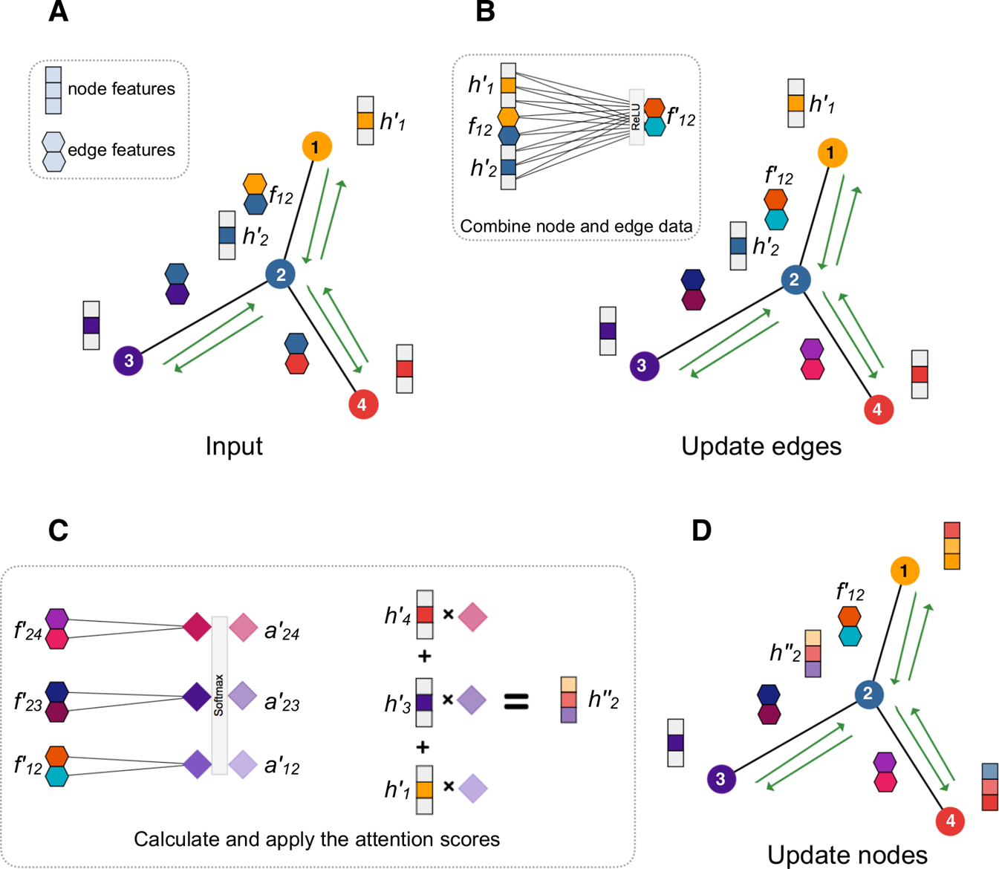

# EdgeGat
Reprository with Graph Attention Layer with fully valuable edge features used in [Rosmmann-toolbox](https://pubmed.ncbi.nlm.nih.gov/34571541/) paper.

## requirements

```
python >= 3.6
torch >=  1.7.0
dgl   >=  0.5.3
```

## example

create graph
```python
import dgl
import torch as th
from egat import EGATConv

num_nodes = 45 
num_node_feats, num_edge_feats = 20, 20
num_attn_heads = 1

contacts = th.rand((num_nodes, num_nodes)) #random distance matrix
adj = contacts > 0.5 #binarize to obtain adjecency matrix
u, v = th.nonzero(adj, as_tuple=True) #edges list
graph = dgl.graph((u,v))    

node_feats = th.rand((num_nodes, num_node_feats)) 
edge_feats = th.rand((graph.number_of_edges(), num_edge_feats))
```

initialize egat layer

```python
#use as regular torch/dgl layer work similar as GATConv from dgl library
egat = EGATConv(in_node_feats=num_node_feats,
                in_edge_feats=num_edge_feats,
                out_node_feats=10,
                out_edge_feats=10,
                num_heads=3)
```

forward pass
```python
new_node_feats, new_edge_feats = egat(graph, node_feats, edge_feats)
#new_node_feats.shape = (*, num_heads, out_node_feats)
#new_eode_feats.shape = (*, num_heads, out_edge_feats)
```
